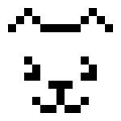
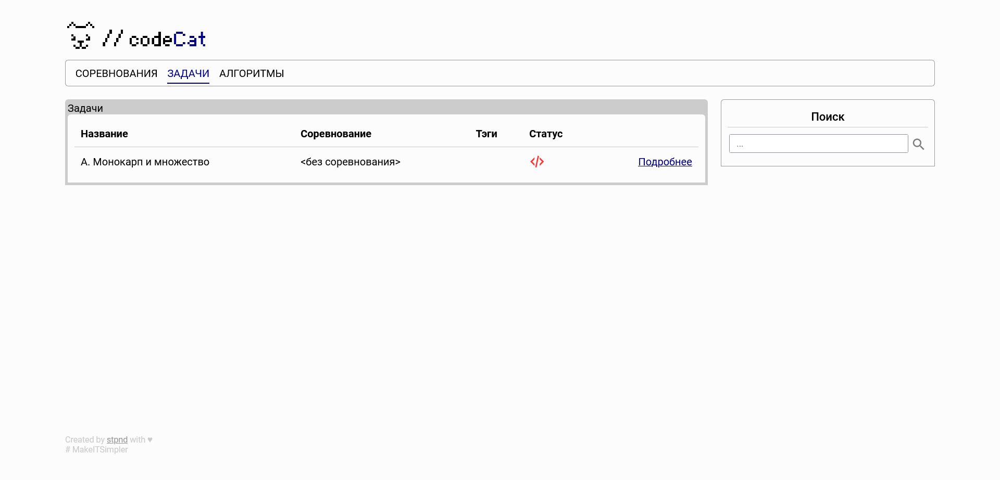

<p align="center">
   <a href="https://github.com/StarPandaBeg/CodeCat">
    
   </a>

   <h3 align="center">CodeCat - CodeForces problem storage</h3>

   <p align="center">
      Simple Task Tracker: Efficiently Organize and Solve Challenges
   </p>
</p>

---

<p align="center">
  
</p>

This is a simple pet project created for learning Flask and organizing personal achievements. Designed to be fast and lightweight, it allows users to store problems from platforms like Codeforces, attach solutions with explanations, and search problems by its text.

# Features

- **Task Organization**: Problems can be organized by attaching them to competitions.
- **Full-text Search**: Enables searching tasks by their text content.
- **Solution Attachment**: Users can attach solutions with explanations to problems for better understanding and reference.

# Getting started

1. Ensure you have Python 3.10 installed
   ```
   $ python --version
   Python 3.10.8
   ```
1. Clone project & install dependencies
   ```
   $ git clone https://github.com/StarPandaBeg/CodeCat
   $ cd CodeCat
   $ pip install -r requirements.txt
   ```
1. Make Initial run

   ```
   $ flask run
   ```

   After that, initial configuration file will be created at `config/flask.json`

1. Add encryption key

   Set `SECRET_KEY` variable in the `config/flask.json` to any unique string.

   ```
   {
      "SERVER_NAME": "localhost:5000",
      "SECRET_KEY": "3d6f45a5fc12445dbac2f59c3b6c7cb1"
   }
   ```

1. Run application again
   ```
   $ flask run
   ```

Open your web browser and visit `http://localhost:5000`. You should see a basic app page.

# License

Distributed under the MIT License.  
See `LICENSE` for more information.

# Disclaimer

This project is my first Flask application. It may contain errors or inaccuracies. I would appreciate your feedback and suggestions for improvement. Thanks! 💗